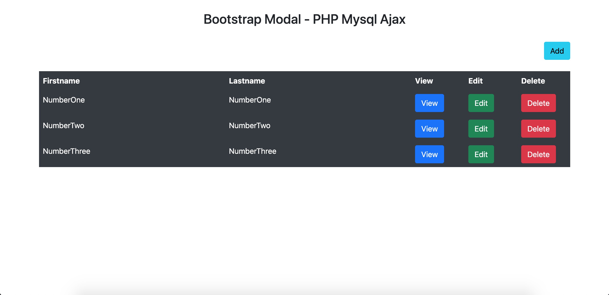
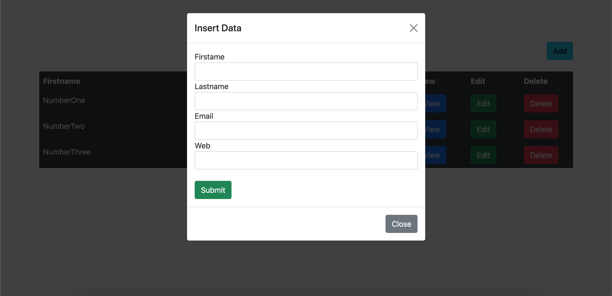
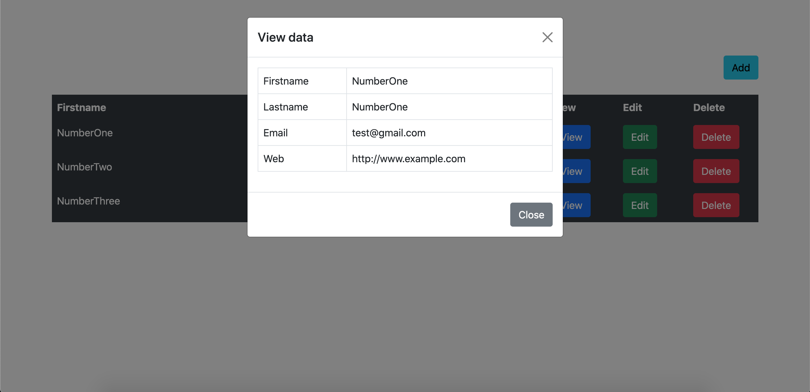

# PHP CRUD
>Basic CRUD PHP MySQL Ajax - Bootstrap Modal 

## Table of Contents
  - [Demo](#demo)
  - [Screenshots](#screenshots)
  - [Technologies](#technologies)
  - [Setup](#setup)
  - [Config project](#config-project)
  - [License](#license)

## Demo
Here is a working live demo: [Basic CRUD](https://young-tor-39660.herokuapp.com/)
## Screenshots
Example web application page
### Home page

### Add data

### View data


## Technologies
Project is created with:
- [php >= 7](https://www.php.net/)
- [Bootstrap 5](https://V5.getbootstrap.com/)
- [jQuery(Ajax)](https://api.jquery.com/)


## Setup
To clone this project, you need [Git](https://git-scm.com) to install on your computer. command line below:

```zsh
# Clone this repository
$ git clone https://github.com/Bongkot-Kladklaen/PHP-CRUD.git

# Go into the repository
$ cd PHP-CRUD
```
## Config project
1. Create database and table :

    Open project `PHP-CRUD` find file `php_crud.sql` and Import file to database server for you
2. Config connect database server : 

    Open project `PHP-CRUD` find folder: `config>config.php` to config: hostname, username, password, database
 
    ```php
        # Config database connect
        define('DB_HOST', 'localhost');         // hostname
        define('DB_USER', 'root');              // username
        define('DB_PASS', 'root');              // password
        define('DB_NAME', 'basic_crud');       // database
    ```

## License
[MIT](LICENSE)
